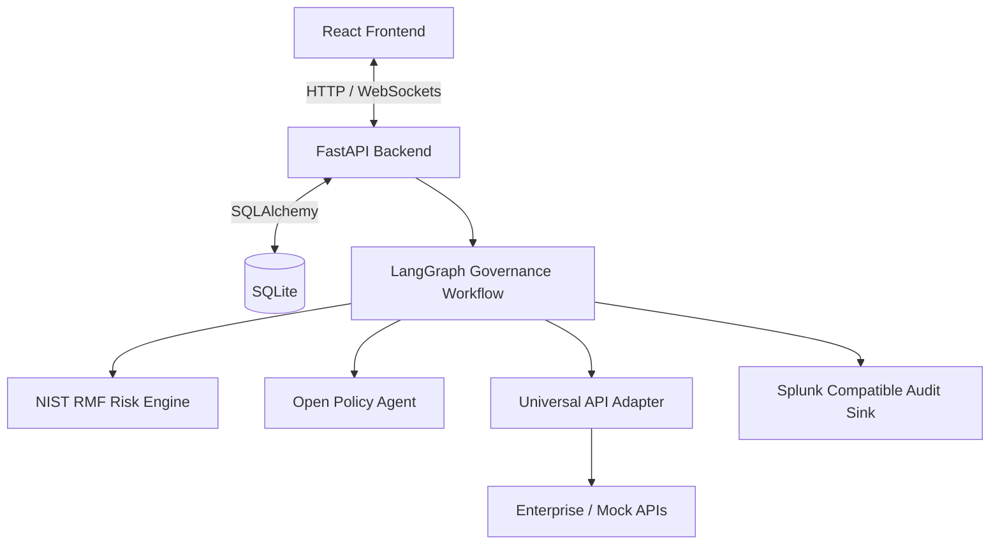

# SentinelAI v2

SentinelAI is a prototype enterprise AI governance platform that acts as a secure control layer between autonomous AI agents and enterprise APIs. Instead of allowing agents to invoke enterprise services directly, every request passes through a centralized governance pipeline where it is authenticated, evaluated using Open Policy Agent (OPA), assessed through a NIST RMF-inspired risk engine, audited using Splunk-compatible structured events, and finally approved, escalated, or denied.

## Key Features

- Open Policy Agent (OPA) based policy enforcement
- NIST RMF-inspired dynamic risk assessment
- Human-in-the-loop approvals
- Enterprise API Registry with Universal API Adapter
- Agent Passport based identity management
- Splunk-compatible structured audit events
- Explainable governance decisions
- Real-time execution monitoring via WebSockets
- Dynamic policy deployment and version history
- Agent reputation scoring

---

# Governance Pipeline

```text
START
↓
API Ingestion
↓
Request Normalization
↓
Agent Identity
↓
Risk Engine (NIST RMF)
↓
OPA Policy Engine
    ├── DENY
    │      ↓
    │   Audit
    │      ↓
    │ Explainability
    │      ↓
    │   Response
    │
    ├── APPROVAL REQUIRED
    │      ↓
    │ Human Approval
    │      ↓
    │ Audit
    │      ↓
    │ Explainability
    │      ↓
    │ Response
    │
    └── ALLOW
           ↓
    Enterprise Execution
           ↓
        Audit
           ↓
    Explainability
           ↓
        Response
```



---

# Project Structure

```text
backend/
│
├── app/
│   ├── api/                 REST APIs & WebSocket endpoints
│   ├── graph/               LangGraph orchestration
│   ├── graph/nodes/         Governance workflow nodes
│   ├── services/            Business services
│   ├── repositories/        CRUD repositories
│   ├── models/              SQLAlchemy models
│   ├── schemas/             Pydantic DTOs
│   ├── adapters/            OPA, Audit & Universal API Adapter
│   ├── policies/rego/       OPA Rego policies
│   └── database/            SQLite configuration
│
frontend/
│
└── src/
    ├── modules/
    │   ├── Dashboard
    │   ├── Agent Management
    │   ├── Governance
    │   ├── Enterprise APIs
    │   ├── Approvals
    │   ├── Audit
    │   ├── Simulation
    │   └── Settings
│
docs/
```

---

# Environment Configuration

Create a `.env` file inside the **backend** directory.

```env
APP_NAME=SentinelAI
APP_ENV=development

API_V1_PREFIX=/api/v1

DATABASE_URL=sqlite:///./sentinelai.db

BACKEND_CORS_ORIGINS=http://localhost:5173,http://127.0.0.1:5173

GRAPH_VERSION=v2

OPA_URL=http://localhost:8181
OPA_DECISION_PATH=/v1/data/sentinelai/governance/decision
OPA_POLICY_BUNDLE_PATH=./app/policies/rego

AUDIT_SINK=sqlite-splunk
```

## Environment Variables

| Variable | Description |
|-----------|-------------|
| APP_NAME | Application name |
| APP_ENV | Runtime environment |
| API_V1_PREFIX | Base prefix for REST APIs |
| DATABASE_URL | SQLite database connection |
| BACKEND_CORS_ORIGINS | Allowed frontend origins |
| GRAPH_VERSION | LangGraph workflow version |
| OPA_URL | OPA REST server URL |
| OPA_DECISION_PATH | OPA decision endpoint |
| OPA_POLICY_BUNDLE_PATH | Location of Rego policies |
| AUDIT_SINK | Audit event backend |

> **Note:** SentinelAI automatically starts and manages the bundled Open Policy Agent during application startup. Ensure port **8181** is available. If OPA cannot be started or becomes unavailable, SentinelAI follows a **Fail Closed** strategy and automatically denies governance requests.

---

# Backend Setup

Install dependencies.

```bash
cd backend
pip install -r requirements.txt
```

Run the backend.

```bash
uvicorn app.main:app --reload
```

Backend

```
http://localhost:8000
```

Swagger Documentation

```
http://localhost:8000/docs
```

---

# Frontend Setup

```bash
cd frontend

npm install

npm run dev
```

Frontend

```
http://localhost:5173
```

If the backend is hosted elsewhere, configure:

```env
VITE_API_BASE_URL=http://localhost:8000/api/v1
```

---

# Open Policy Agent (OPA)

SentinelAI uses **Open Policy Agent (OPA)** as its centralized policy engine. Governance policies are written as **Rego** files and stored under:

```text
backend/app/policies/rego
```

Whenever governance policies are created, updated, or deployed, SentinelAI automatically regenerates the Rego policies and reloads the embedded OPA instance without any manual intervention.

Every governance request is evaluated through:

```text
http://localhost:8181/v1/data/sentinelai/governance/decision
```

If policy evaluation fails or OPA becomes unavailable, SentinelAI follows a **Fail Closed** model and automatically denies the request.

---

# Governance Execution API

All AI agents communicate with SentinelAI through a single governance endpoint.

```http
POST /api/v1/governance/execute
```

Instead of calling enterprise APIs directly, agents submit standardized governance requests. SentinelAI performs:

- Agent Identity Verification
- Risk Assessment
- Policy Evaluation
- Human Approval Checks
- Audit Logging
- Enterprise API Execution
- Explainability Generation

before returning the final decision.

---

## Request Format

```json
{
  "metadata": {
    "passportId": "AGENT-INV-001",
    "agentVersion": "1.0.0",
    "idempotencyKey": "request-12345"
  },
  "execution": {
    "service": "word-service",
    "operation": "get-word",
    "parameters": {}
  }
}
```

### Metadata

| Field | Description |
|---------|-------------|
| passportId | Unique Agent Passport used to authenticate and identify the calling AI agent. This identifier should be securely stored to prevent impersonation. |
| agentVersion | Current deployed version of the AI agent. |
| idempotencyKey | Prevents duplicate execution of identical requests. |

### Execution

| Field | Description |
|---------|-------------|
| service | Enterprise service registered within SentinelAI. |
| operation | Target operation exposed by the enterprise service. |
| parameters | Payload forwarded to the enterprise API after governance approval. |

---

# Governance Response

Every execution returns both the business response and governance metadata.

Example:

```json
{
  "requestId": "3bb47ef5-6f1b-4d35-bd89-c522fb1ef2a9",
  "decision": "ALLOW",
  "riskScore": 12,
  "reason": "Policy evaluation successful",
  "approvalRequired": false,
  "result": {
    "word": "Sentinel"
  }
}
```

### Response Fields

| Field | Description |
|---------|-------------|
| requestId | Unique execution identifier used for tracing and auditing. |
| decision | Final governance decision (`ALLOW`, `DENY`, or `HUMAN_REVIEW`). |
| riskScore | Risk score generated by the NIST RMF-inspired Risk Engine. |
| reason | Human-readable explanation describing why the decision was made. |
| approvalRequired | Indicates whether manual approval is required. |
| result | Enterprise API response when execution succeeds. |

Every request—whether allowed, denied, or escalated—produces a structured Splunk-compatible audit event, ensuring complete traceability throughout the governance pipeline.

---

# Demo Agent Passports

| Passport ID | Agent |
|-------------|-----------------------|
| AGENT-INV-001 | Invoice Agent |
| AGENT-REF-002 | Refund Agent |
| AGENT-MER-003 | Merchant Agent |
| AGENT-BOOK-004 | Suspended Booking Agent |
| AGENT-IT-005 | Blocked IT Support Agent |

---

# API Endpoints

| Category | Endpoints |
|-----------|-----------|
| Health | `GET /api/v1/health` |
| Dashboard | `GET /api/v1/dashboard` |
| Governance | `POST /api/v1/governance/execute`<br>`POST /api/v1/governance/simulate`<br>`GET /api/v1/governance/samples`<br>`WS /api/v1/ws/governance/live` |
| Policies | `GET /api/v1/policies`<br>`GET /api/v1/policies/governance`<br>`POST /api/v1/policies/governance`<br>`GET /api/v1/policies/budgets`<br>`POST /api/v1/policies/budgets`<br>`POST /api/v1/policies/deploy`<br>`GET /api/v1/policies/history` |
| Enterprise APIs | `GET /api/v1/enterprise`<br>`GET /api/v1/enterprise/lookups` |
| Human Approvals | `GET /api/v1/approvals`<br>`POST /api/v1/approvals/{approval_id}/approve` |
| Audit | `GET /api/v1/audit` |

---

# Database Initialization

On startup, SentinelAI automatically performs a lightweight migration that upgrades the legacy **v1 audit schema** into the new **Splunk-compatible v2 audit schema**.

Initial seed data includes:

- Agent Passports
- Enterprise APIs
- Governance Policies
- Budget Policies

The following entities are generated dynamically during runtime:

- Audit Logs
- Human Approvals
- Execution History
- Workflow History

---

# Technology Stack

### Backend

- FastAPI
- Python
- LangGraph
- SQLAlchemy
- SQLite
- WebSockets

### Governance

- Open Policy Agent (OPA)
- Rego Policies
- NIST RMF-inspired Risk Engine
- Universal API Adapter
- Splunk-Compatible Audit Events

### Frontend

- React
- TypeScript
- Tailwind CSS
- React Flow
- Recharts

---
