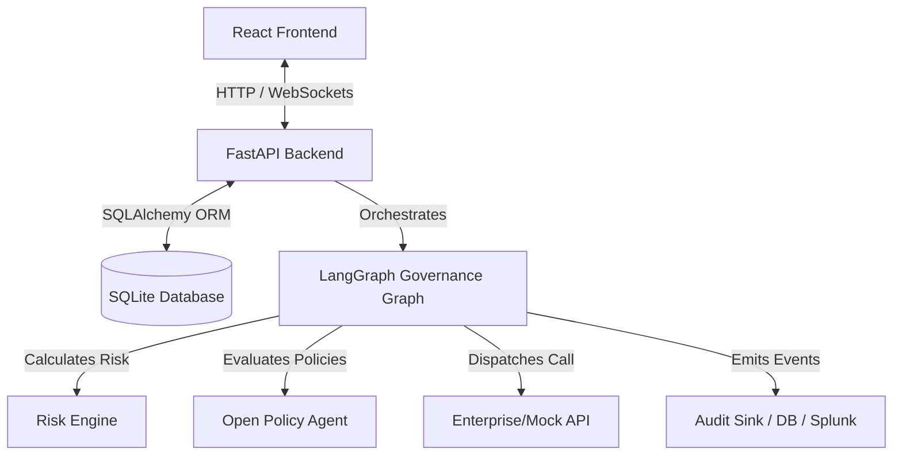

# SentinelAI Architecture Overview

Welcome to the SentinelAI codebase. This document is designed to help new developers quickly understand the project's purpose, design, implementation choices, and request lifecycle.

---

## 1. Architecture Overview

### Purpose of the Project
SentinelAI is an Enterprise AI Governance Platform designed to intercept, normalized, validate, and execute API requests sent by autonomous AI agents. It ensures that agents remain within compliance guardrails (using **Open Policy Agent (OPA)** rules) and budget limits before executing operations on enterprise services.

### High-Level Architecture
SentinelAI is structured as a decoupled client-server application:
1. **Frontend (React)**: An interactive dashboard allowing operators to register agents, manage policies, clear human-approval requests, browse logs, and run simulations.
2. **Backend (FastAPI)**: A stateless Web API serving REST endpoints and WebSockets.
3. **Governance Engine (LangGraph)**: An asynchronous workflow state machine that orchestrates request validation, risk assessment, policy evaluation, and enterprise API execution.
4. **Open Policy Agent (OPA)**: An external policy decision engine that evaluates Rego rules generateVd dynamically from the dashboard.
5. **SQLite Database**: The relational persistence layer storing configurations, logs, and state.



### Major Components and Their Responsibilities

| Component | Responsibility |
| :--- | :--- |
| **FastAPI App** | Serves REST endpoints for system administration and a WebSocket channel for streaming graph events. |
| **Governance Graph** | A LangGraph DAG executing nodes for ingestion, normalization, identity verification, risk, policy evaluation, approval verification, and API execution. |
| **OpaPolicyAdapter** | Handles JSON payloads, formats them, and calls the OPA REST API (`http://localhost:8181`). |
| **UniversalAPIAdapter** | Dynamically routes, retries, and executes downstream enterprise API requests using HTTP/Mock endpoints. |
| **PolicyDeploymentService** | Compiles UI-designed policies to Rego syntax, runs sanity syntax checks, writes the file to disk, and restarts the OPA server. |
| **AuditService & Sinks** | Standardizes multi-stage logging and commits structural events to the database using a Splunk-compatible format. |

---

## 2. Repository Structure

```
.
├── backend
│   └── app
│       ├── adapters       # Infrastructure Adapters (OPA, External APIs, Splunk Sink)
│       ├── api            # API Routing & Controllers (REST & WebSockets)
│       ├── core           # Base configuration, logging, and daemon lifecycles (OPA runner)
│       ├── database       # DB Session, Seed script, Schema Initialization
│       ├── graph          # LangGraph DAG definition, State schemas, and Conditional routing
│       │   └── nodes      # Step definitions for each stage of the pipeline
│       ├── models         # SQLAlchemy database models
│       ├── policies       # Local storage for generated Rego bundle files
│       ├── repositories   # Database queries separated via the Repository Pattern
│       ├── schemas        # Pydantic models for validation and serialization
│       ├── services       # Service layer containing the core business logic
│       └── utils          # Common helper libraries (time, serialization)
└── frontend
    └── src
        ├── app            # Entrypoint, Router configuration, and Providers
        ├── components     # Reusable layout and style widgets (Badges, Buttons, Tables, Cards)
        ├── layouts        # High-level layouts (MainLayout, PageHeader)
        ├── modules        # Domain-driven features (Dashboard, Agents, Approvals, Audit, Simulation)
        ├── store          # Zustand store for global application states
        └── utils          # Frontend formatting utilities
```

---

## 3. Tech Stack

### Languages & Frameworks
* **Backend**: Python 3.12, FastAPI (high-performance ASGI web framework).
* **Frontend**: JavaScript (ES6+), React 18, Vite (fast tooling).

### Core Libraries
* **State Machine & DAG**: `langgraph` for compiling and running the workflow graph.
* **Database Access**: `SQLAlchemy` (ORM) for object relation mapping and SQLite driver.
* **Data Validation**: `Pydantic` v2 (schemas) and Pydantic Settings.
* **Frontend Client State**: `@tanstack/react-query` (server state cache), `zustand` (UI state management).
* **Routing**: `react-router-dom` v6.
* **Icons**: `lucide-react`.

### Database
* **SQLite**: Single-file database used for lightweight and self-contained execution.

### Policy Engine
* **Open Policy Agent (OPA)**: Runs sidecar-style on port `8181` to evaluate declarative Rego policies.

---

## 4. Application Flow

### Startup Flow
1. The backend application launches via Uvicorn.
2. During the `@app.on_event("startup")` lifecycle hook:
   * **Database check**: `init_database()` is invoked, running schema migrations (`_migrate_prototype_schema`) and seeding static records (`seed_database`).
   * **OPA daemon check**: `start_opa_server` automatically starts the OPA executable pointing to the local `./app/policies/rego` bundle directory.
3. The Vite frontend launches and connects to the backend REST endpoints.

### Request Flow & Execution Pipeline

```mermaid
sequenceDiagram
    autonumber
    actor Agent as AI Agent Client
    participant API as FastAPI Router
    participant Graph as LangGraph Execution
    participant OPA as Open Policy Agent
    participant Ext as Enterprise API
    participant DB as SQLite DB
    
    Agent->>API: POST /api/v1/governance/execute
    API->>Graph: Compile & Invoke graph.execute(request)
    activate Graph
    Graph->>Graph: [Node] Ingest & Normalise request parameters
    Graph->>DB: [Node] Load Agent Passport Identity & Policy Groups
    alt Agent is Blocked or Flagged Inactive
        Graph->>Graph: Bypass execution, set Decision = DENY
    else Valid Identity
        Graph->>Graph: [Node] Assess NIST RMF Risk Category & Score
        Graph->>OPA: [Node] HTTP Evaluate policy input against OPA Rules
        OPA-->>Graph: Returns Decision (ALLOW / DENY / REQUIRE_APPROVAL)
    end
    
    alt OPA Decision is DENY
        Graph->>Graph: Route directly to Audit
    else OPA Decision is REQUIRE_APPROVAL
        Graph->>DB: [Node] Persist Pending Approval Request
        Graph->>Graph: Pause Workflow & Exit (Polled/Resumed by human decision)
    else OPA Decision is ALLOW
        Graph->>Ext: [Node] UniversalAPIAdapter dispatches HTTP call
        Ext-->>Graph: Returns execution response and latency
    end
    
    Graph->>DB: [Node] Emit detailed Splunk-style Audit Logs
    Graph->>Graph: [Node] Explain execution timeline & build response
    deactivate Graph
    Graph-->>API: Finished state snapshot
    API-->>Agent: Final JSON response with authorization status
```


---

## 5. Component Interaction

SentinelAI promotes unidirectional module communication:

1. **API Layer to Service Container**: Controllers instantiate the `ServiceContainer` dependency graph through FastAPI's dependency injection (`Depends(get_services)`).
2. **Service Container to Graph**: The controller builds `GovernanceGraph(services, emit_event_sink)`, passing the complete service graph to the nodes.
3. **Graph Nodes to Domain Services**: Individual nodes (e.g., `build_policy_engine_node`) extract their respective domains (e.g., `services.policies`) to query or evaluate data.
4. **Service Layer to Repositories & Adapters**: Business services manipulate tables through domain-specific repositories and connect to network nodes via adapter classes.
5. **Real-time Event Streaming**: A WebSocket handler (`/ws/governance/live`) registers a custom callback `emit(event)` which is bound to the graph. As the graph executes each node asynchronously, events are pushed live to the React UI, rendering progress in real-time.

---

## 6. Key Design Decisions

### 1. Architecture Patterns
* **Clean Architecture / Ports & Adapters**: Isolates the core business rules from external frameworks (FastAPI, SQLite, OPA, network protocols) using Adapters (`OpaPolicyAdapter`, `SQLiteSplunkAuditSink`).
* **Repository Pattern**: Prevents SQL query pollution in business logic, abstracting transactions inside subclassed repositories.
* **Single Store for UI State**: Uses Zustand to hold the `simulationState` and `liveState`. This ensures state persistence in the Simulation Lab even when navigating tabs.

### 2. Design Patterns
* **Service Locator**: The `ServiceContainer` bundles all services, adapters, and database connections into a single namespace, simplifying node creation.
* **State Machine (Reducer-style)**: LangGraph updates the state dictionary incrementally. Each node returns a dict patch that is merged into the overall execution state.
* **Fail-Closed Default**: In case OPA is unreachable, `OpaPolicyAdapter` automatically generates a fallback `DENY` decision to guarantee safety.

---

## 7. Extensibility

### Adding a New Graph Node
1. Define the node state schema in `app/graph/state.py` if new fields are needed.
2. Create the node builder in `app/graph/nodes/new_node.py` utilizing the helper `run_governance_node`.
3. Add the node to `_add_nodes` in `app/graph/graph.py` and hook it into the chain using `workflow.add_edge()` or conditional routing in `app/graph/routing.py`.

### Adding a New Integration Adapter
1. Create a class under `app/adapters/` inheriting from an abstract base class (or define a new domain wrapper).
2. Register the adapter in the `ServiceContainer` inside `backend/app/services/container.py` and pass it to the necessary domain service.

---

## 8. Summary

### Architecture Strengths
* **Highly Observable**: The node-based workflow generates precise event steps with durations and states, visible in both WebSockets and DB audit records.
* **Decoupled Policies**: Policies are created inside the database, but compiled and validated externally using OPA, combining UI agility with fast compiled checks.
* **Robust Code-Validation**: The backend incorporates an internal bracket-balancing fallback syntax checker when the external OPA CLI is missing.

### Potential Improvements
* **Polling in REST endpoint**: The REST execution endpoints block and poll the DB for human approvals (`asyncio.sleep`). An asynchronous message queue (e.g. Redis, Celery) or a fully callback-based webhook model would be more scalable for long-running approval workflows.
* **State Locking**: Database state snapshots are currently stored as raw serialized JSON inside columns. Implementing database locking or transaction levels would prevent race conditions under high concurrency.
